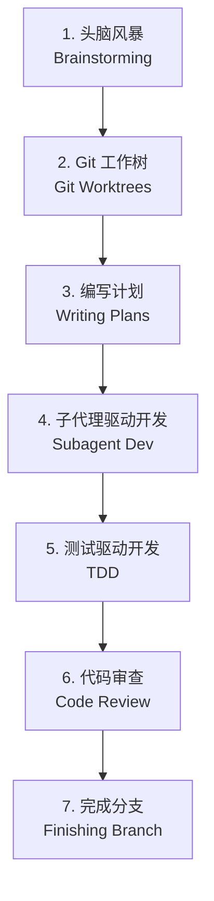

# Superpowers

> 为 AI 编码代理设计的完整软件开发工作流系统

Superpowers 是一套构建在可组合"技能"（skills）之上的完整软件开发工作流，配合初始指令确保你的 AI 代理正确使用这些技能。

**当前版本**: v4.2.0
**作者**: Jesse Vincent
**许可证**: MIT

## 目录

- [工作原理](#工作原理)
- [核心概念](#核心概念)
- [安装指南](#安装指南)
- [基础工作流](#基础工作流)
- [技能库概览](#技能库概览)
- [设计理念](#设计理念)
- [学习路径](#学习路径)

---

## 工作原理

Superpowers 从你启动编码代理的那一刻开始工作。当它发现你在构建某样东西时，**不会**直接跳进去写代码。相反，它会退一步，询问你真正想要实现什么。

一旦从对话中提炼出规格说明，它会以足够短小的分块方式展示给你，便于实际阅读和消化。

在你批准设计后，代理会组装一个清晰到足以让充满热情但缺乏判断力、没有项目上下文且厌恶测试的初级工程师遵循的实施计划。它强调真正的红绿 TDD、YAGNI（你不会需要它）和 DRY（不要重复自己）。

接下来，当你说"开始"时，它会启动**子代理驱动开发**（subagent-driven-development）流程，让代理处理每个工程任务，检查和审查它们的工作，然后继续前进。Claude 通常可以自主工作数小时而不偏离你们一起制定的计划。

这就是系统的核心。而且因为技能会自动触发，你不需要做任何特殊操作。你的编码代理自然就拥有了超能力。

---

## 核心概念

### 什么是技能（Skill）？

技能是包含特定工作流程和最佳实践的 Markdown 文件，通过 YAML 前置元数据描述触发条件。当 AI 代理执行相关任务时，相应的技能会自动加载。

**技能类型**：

| 类型 | 说明 | 示例 |
|------|------|------|
| **纪律强制型** | 强制遵循规则，不可绕过 | TDD、验证-before-完成 |
| **技术型** | 如何做某事的指南 | 条件等待、根因追踪 |
| **模式型** | 解决问题的思维模型 | 头脑风暴、系统化调试 |
| **参考型** | API 文档、命令参考 | Git worktree 操作指南 |

### 自动触发机制

技能通过语义搜索自动发现。技能的 `description` 字段必须描述触发条件/症状，而不是技能的工作流程或过程。

**示例**：
```yaml
---
name: brainstorming
description: "You MUST use this before any creative work - creating features, building components, adding functionality, or modifying behavior."
---
```

当你说"帮我构建一个新功能"时，AI 会自动触发 `brainstorming` 技能。

---

## 安装指南

**注意**：不同平台的安装方式不同。Claude Code 有内置插件系统，Codex 和 OpenCode 需要手动设置。

### Claude Code（通过插件市场）

在 Claude Code 中，首先注册市场：

```bash
/plugin marketplace add obra/superpowers-marketplace
```

然后从此市场安装插件：

```bash
/plugin install superpowers@superpowers-marketplace
```

### 验证安装

启动新会话并请求 Claude 帮助触发技能的任务（例如"帮我规划这个功能"或"让我们调试这个问题"）。Claude 应该自动调用相关的 superpowers 技能。

### Codex

告诉 Codex：

```
Fetch and follow instructions from https://raw.githubusercontent.com/obra/superpowers/refs/heads/main/.codex/INSTALL.md
```

**详细文档**: [docs/README.codex.md](../README.codex.md)

### OpenCode

告诉 OpenCode：

```
Fetch and follow instructions from https://raw.githubusercontent.com/obra/superpowers/refs/heads/main/.opencode/INSTALL.md
```

**详细文档**: [docs/README.opencode.md](../README.opencode.md)

---

## 基础工作流

Superpowers 的核心工作流包含七个阶段，每个阶段由特定的技能指导：



### 1. 头脑风暴（Brainstorming）

**触发时机**：写代码之前

通过提问细化粗略的想法，探索替代方案，分块展示设计以供验证。保存设计文档。

### 2. 使用 Git 工作树（Using Git Worktrees）

**触发时机**：设计批准之后

在新分支上创建隔离的工作空间，运行项目设置，验证干净的测试基线。

### 3. 编写计划（Writing Plans）

**触发时机**：拥有批准的设计后

将工作分解为小任务（每项 2-5 分钟）。每个任务都有确切的文件路径、完整的代码和验证步骤。

### 4. 子代理驱动开发或执行计划（Subagent Dev / Executing Plans）

**触发时机**：拥有计划后

- **子代理驱动开发**：为每个任务分派新的子代理，进行两阶段审查（规格合规性，然后代码质量）
- **执行计划**：批量执行并设置人工检查点

### 5. 测试驱动开发（Test-Driven Development）

**触发时机**：实现期间

强制 RED-GREEN-REFACTOR 循环：先写失败的测试，看它失败，编写最少的代码，看它通过，提交。删除在测试之前编写的代码。

### 6. 请求代码审查（Requesting Code Review）

**触发时机**：任务之间

根据计划进行审查，按严重程度报告问题。关键问题会阻止进度。

### 7. 完成开发分支（Finishing Development Branch）

**触发时机**：任务完成时

验证测试，呈现选项（合并/PR/保留/丢弃），清理工作树。

**重要**：代理在任何任务之前都会检查相关技能。这些都是强制性工作流，而非建议。

---

## 技能库概览

Superpowers 包含 14 个核心技能，按功能分类：

### 测试

| 技能 | 说明 |
|------|------|
| **test-driven-development** | RED-GREEN-REFACTOR 循环（包含测试反模式参考） |

### 调试

| 技能 | 说明 |
|------|------|
| **systematic-debugging** | 4 阶段根本原因分析流程（包含根因追踪、深度防御、条件等待技术） |
| **verification-before-completion** | 确保问题真正得到修复 |

### 协作

| 技能 | 说明 |
|------|------|
| **brainstorming** | 苏格拉底式设计细化 |
| **writing-plans** | 详细的实施计划 |
| **executing-plans** | 带检查点的批量执行 |
| **dispatching-parallel-agents** | 并发子代理工作流 |
| **requesting-code-review** | 预审查检查清单 |
| **receiving-code-review** | 响应反馈 |
| **using-git-worktrees** | 并行开发分支 |
| **finishing-a-development-branch** | 合并/PR 决策工作流 |
| **subagent-driven-development** | 带两阶段审查的快速迭代 |

### 元技能

| 技能 | 说明 |
|------|------|
| **writing-skills** | 遵循最佳实践创建新技能（包含测试方法论） |
| **using-superpowers** | 技能系统介绍 |

---

## 设计理念

Superpowers 的设计基于以下核心原则：

| 原则 | 说明 |
|------|------|
| **测试驱动开发** | 始终先写测试 |
| **系统化而非临时性** | 流程优于猜测 |
| **降低复杂度** | 简单性是主要目标 |
| **证据优于声明** | 在宣布成功之前先验证 |

这些原则确保 AI 代理产生可靠、可维护的代码，而不是快速但脆弱的解决方案。

---

## 学习路径

我们为不同目标的学习者设计了三条学习路径：

### 用户路径

**目标人群**：只想使用 Superpowers 提高效率的开发者

**核心问题**："这个怎么用？"

**学习内容**：
1. 安装和配置
2. 基础工作流（7 个阶段）
3. 常用技能使用
4. 实战案例

### 开发路径

**目标人群**：想参与 Superpowers 开发或创建自定义技能的开发者

**核心问题**："这个怎么实现的？"

**学习内容**：
1. 技能系统架构
2. 插件集成机制
3. 技能创建和测试
4. 贡献流程

### 进阶路径

**目标人群**：想提升技术能力和架构设计水平的高级开发者

**核心问题**："为什么这样设计？"

**学习内容**：
1. 设计决策和权衡
2. AI 代理工作流优化
3. 技能系统设计模式
4. 最佳实践和反模式

> 详细的学习路径文档正在编写中，敬请期待。

---

## 贡献指南

技能直接存放在此仓库中。要做出贡献：

1. Fork 此仓库
2. 为你的技能创建分支
3. 遵循 `writing-skills` 技能创建和测试新技能
4. 提交 PR

完整指南请参阅 `skills/writing-skills/SKILL.md`。

---

## 更新

技能会在你更新插件时自动更新：

```bash
/plugin update superpowers
```

---

## 支持

- **问题反馈**: https://github.com/obra/superpowers/issues
- **插件市场**: https://github.com/obra/superpowers-marketplace
- **博客文章**: [Superpowers for Claude Code](https://blog.fsck.com/2025/10/09/superpowers/)

---

## 许可证

MIT License - 详见 LICENSE 文件

---

## 赞助

如果 Superpowers 帮助你完成了赚钱的事情，并且你愿意的话，我将非常感激你考虑[赞助我的开源工作](https://github.com/sponsors/obra)。

谢谢！

- Jesse
