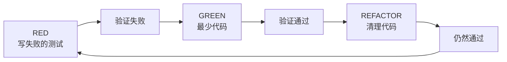

# Superpowers 技能库概览

> ⭐⭐ Level 2 - 核心概念

**学习目标**：完成本章后，你将能够：

- [ ] 理解所有 14 个核心技能的用途和触发条件
- [ ] 知道何时使用哪个技能
- [ ] 理解技能之间的协作关系
- [ ] 能够根据项目需求选择合适的技能组合

**预计学习时间**：30-40 分钟

---

## 目录

- [技能分类](#技能分类)
- [测试技能](#测试技能)
- [调试技能](#调试技能)
- [协作技能](#协作技能)
- [元技能](#元技能)
- [技能关系图](#技能关系图)

---

## 技能分类

Superpowers 的 14 个核心技能按功能分为四类：

```
Superpowers 技能体系
├── 测试（1 个）
│   └── test-driven-development
├── 调试（2 个）
│   ├── systematic-debugging
│   └── verification-before-completion
├── 协作（9 个）
│   ├── brainstorming
│   ├── writing-plans
│   ├── executing-plans
│   ├── dispatching-parallel-agents
│   ├── requesting-code-review
│   ├── receiving-code-review
│   ├── using-git-worktrees
│   ├── finishing-a-development-branch
│   └── subagent-driven-development
└── 元技能（2 个）
    ├── writing-skills
    └── using-superpowers
```

---

## 测试技能

### test-driven-development（测试驱动开发）

**难度**: ⭐⭐

**描述**: 在实现任何功能或错误修复之前使用，在编写实现代码之前

**核心原则**：

```
没有失败的测试，就没有生产代码。
```

**工作流程**：



**关键规则**：

| 规则 | 说明 |
|------|------|
| 先写测试 | 在任何实现代码之前 |
| 观察失败 | 确认测试因功能缺失而失败 |
| 最少代码 | 只写足够让测试通过的代码 |
| 持续绿色 | 重构时保持测试通过 |

**何时使用**：
- ✅ 新功能开发
- ✅ Bug 修复
- ✅ 代码重构
- ❌ 一次性原型（需征得同意）

**常见误区**：

| 误区 | 现实 |
|------|------|
| "太简单不需要测试" | 简单代码也会出问题 |
| "测试后补也一样" | 后补的测试不会失败，无法验证 |
| "手动测试过了" | 无法重现，没有记录 |

**相关资源**：
- 包含 `testing-anti-patterns.md` 反模式参考
- 完整的 RED-GREEN-REFACTOR 循环示例

---

## 调试技能

### systematic-debugging（系统化调试）

**难度**: ⭐⭐⭐

**描述**: 在调查 bug、错误或意外行为时使用

**核心方法**：四阶段根本原因分析流程

```
问题发现
    ↓
根因追踪 ← 追溯到源头
    ↓
深度防御 ← 多层验证
    ↓
条件等待 ← 稳定复现
    ↓
修复验证 ← 确保真正修复
```

**包含技术**：

1. **根因追踪（Root Cause Tracing）**
   - 通过调用栈反向追踪 bug
   - 找到问题的真正起源而非症状

2. **深度防御（Defense in Depth）**
   - 在多层添加验证
   - 防止单一检查失效

3. **条件等待（Condition-Based Waiting）**
   - 替代任意超时
   - 使用条件轮询

4. **查找污染者（Find Polluter）**
   - `find-polluter.sh` 脚本
   - 二分查找哪个测试导致了状态污染

**何时使用**：
- ✅ 生产环境 bug
- ✅ 测试失败原因不明
- ✅ 偶发性行为
- ✅ 性能问题

### verification-before-completion（完成前验证）

**难度**: ⭐⭐

**描述**: 在声明问题修复完成之前使用

**核心检查**：

```markdown
## 验证清单

- [ ] 问题能够复现（在修复前）
- [ ] 根本原因已识别
- [ ] 修复针对根本原因
- [ ] 测试覆盖了修复
- [ ] 问题不再存在（在修复后）
- [ ] 没有引入新问题
```

**为什么重要**：

```
常见情况：修复了症状，但问题仍然存在

示例：空指针异常
错误修复：添加空检查 → 症状消失
真正问题：为什么会有空值？ → 未解决
```

---

## 协作技能

### brainstorming（头脑风暴）

**难度**: ⭐

**描述**：**必须**在任何创造性工作之前使用——创建功能、构建组件、添加功能或修改行为

**工作流程**：

```
了解项目
    ↓
一次问一个问题
    ↓
探索多种方案
    ↓
分块展示设计
    ↓
验证每个部分
```

**关键原则**：

| 原则 | 说明 |
|------|------|
| 一次一问 | 不信息过载 |
| 多选优先 | 更容易回答 |
| YAGNI | 无情删减不必要功能 |
| 探索替代 | 总是提出 2-3 种方案 |
| 增量验证 | 分块展示，逐步确认 |

**输出**：
- 设计文档：`docs/plans/YYYY-MM-DD-<topic>-design.md`

**何时使用**：
- ✅ 新功能
- ✅ 重大修改
- ✅ 架构决策
- ❌ 简单的 bug 修复（直接调试）

### writing-plans（编写计划）

**难度**: ⭐⭐

**描述**：在设计批准后，将工作分解为可执行的任务

**计划结构**：

```markdown
## 功能名称

### 背景
简述要实现的功能

### 任务列表

#### 任务 1：[任务名称]
- **文件**: `path/to/file.ts`
- **操作**: 具体要做什么
- **验证**: 如何确认完成

#### 任务 2：...
```

**任务分解原则**：

| 原则 | 说明 | 示例 |
|------|------|------|
| 小任务 | 2-5 分钟可完成 | "添加字段"而非"实现用户系统" |
| 明确路径 | 精确到文件 | `src/auth/login.ts` |
| 可验证 | 有明确的完成标准 | "测试通过"而非"能用" |

### subagent-driven-development（子代理驱动开发）

**难度**: ⭐⭐⭐

**描述**：使用子代理执行计划，每个任务配备两阶段审查

**工作流程**：

```
主代理
    ↓
分派任务 → 子代理（完整任务上下文）
    ↓
      └─→ 子代理：理解任务 → 执行 → 自我审查
    ↓
主代理审查
    ├─→ 规格合规审查（怀疑态度）
    │   └─→ 不通过 → 子代理修改 → 重新审查
    ├─→ 代码质量审查（仅在规格通过后）
    │   └─→ 不通过 → 子代理修改 → 重新审查
    └─→ 通过 → 下一个任务
```

**两阶段审查**：

1. **规格合规审查**
   - 怀疑态度：不相信实现者的报告
   - 直接阅读代码
   - 检查缺失需求和过度构建

2. **代码质量审查**
   - 清洁代码
   - 测试覆盖
   - 可维护性

**何时使用**：
- ✅ 复杂功能（多个任务）
- ✅ 需要深度审查
- ✅ 长时间自主工作

### executing-plans（执行计划）

**难度**: ⭐⭐

**描述**：批量执行计划任务，设置人工检查点

**与子代理驱动的区别**：

| 特性 | 子代理驱动 | 执行计划 |
|------|-----------|----------|
| 执行方式 | 每任务新子代理 | 批量执行 |
| 审查 | 自动两阶段 | 人工检查点 |
| 自主性 | 高（数小时） | 中（需人工确认） |
| 适用场景 | 复杂多任务 | 简单任务或偏好人工控制 |

**工作流程**：

```
选择检查点
    ↓
批量执行到检查点
    ↓
报告完成状态
    ↓
等待人工确认
    ↓
继续下一批
```

### using-git-worktrees（使用 Git 工作树）

**难度**: ⭐⭐

**描述**：创建隔离的开发工作空间

**为什么需要工作树**：

```
传统方式的问题：
- 在主分支工作 → 污染主分支
- 频繁切换分支 → 编译产物冲突
- 同时多个任务 → 难以并行

工作树的优势：
- 每个功能独立目录
- 主分支保持干净
- 可以真正并行工作
```

**使用流程**：

```bash
# 创建工作树
git worktree add ../project-feature-1 feature-1

# 在新工作树中工作
cd ../project-feature-1
# ... 进行开发 ...

# 完成后删除
git worktree remove ../project-feature-1
```

**何时使用**：
- ✅ 任何开发工作开始前
- ✅ 需要并行处理多个功能
- ✅ 想保持主分支干净

### requesting-code-review（请求代码审查）

**难度**: ⭐⭐

**描述**：在任务之间进行预审查

**审查维度**：

| 维度 | 检查内容 | 严重性 |
|------|----------|--------|
| 计划合规 | 是否完成计划中的所有工作 | 阻塞 |
| 测试覆盖 | 是否有充分的测试 | 重要 |
| 代码质量 | 代码是否清晰易维护 | 重要 |
| 文档 | 是否更新了相关文档 | 建议 |

**问题报告格式**：

```markdown
## 代码审查报告

### 阻塞问题（必须修复）
- [ ] 缺少错误处理

### 重要问题（应该修复）
- [ ] 测试未覆盖边界情况

### 建议（可以改进）
- [ ] 变量名可以更清晰
```

### receiving-code-review（接收代码审查）

**难度**: ⭐

**描述**：响应审查反馈

**响应策略**：

| 反馈类型 | 响应方式 |
|----------|----------|
| 明确问题 | 修复并说明 |
| 建议改进 | 采纳或解释原因 |
| 误解 | 礼貌澄清 |

**GitHub PR 提示**：
- 在原线程回复行内评论
- 不在顶层重复反馈内容

### finishing-a-development-branch（完成开发分支）

**难度**: ⭐

**描述**：任务完成时的收尾工作

**流程**：

```markdown
## 完成分支检查清单

- [ ] 所有测试通过
- [ ] 代码已审查
- [ ] 文档已更新
- [ ] 提交信息清晰

## 选择下一步

1. **合并到主分支** - 功能完整，准备发布
2. **创建 PR** - 需要团队审查
3. **保持分支** - 工作未完成，稍后继续
4. **丢弃分支** - 不再需要此更改
```

### dispatching-parallel-agents（并行代理调度）

**难度**: ⭐⭐⭐

**描述**：并发执行独立的子代理工作流

**使用场景**：

```
任务 A ─┐
        ├─→ 并行执行 → 收集结果
任务 B ─┘
任务 C ─┘

条件：任务之间无依赖关系
```

**何时使用**：
- ✅ 独立任务可以并行
- ✅ 需要加快总体速度
- ❌ 任务之间有依赖

---

## 元技能

### using-superpowers（使用超能力）

**难度**: ⭐

**描述**：每次对话开始时建立——如何查找和使用技能

**核心规则**：

```
在任何响应或行动之前，调用相关或请求的技能。
即使只有 1% 的可能性技能适用，也要调用技能来检查。
```

**红旗警告**（意味着你在找借口）：

| 想法 | 现实 |
|------|------|
| "这只是个简单问题" | 问题也是任务，检查技能 |
| "我需要更多上下文" | 技能检查在提问之前 |
| "让我先探索代码" | 技能告诉你如何探索 |
| "我记得这个技能" | 技能会演进，读取当前版本 |
| "我知道那是什么意思" | 了解概念 ≠ 使用技能 |

### writing-skills（编写技能）

**难度**: ⭐⭐⭐

**描述**：创建遵循最佳实践的新技能

**TDD 方法论应用于文档**：

```
RED   → 没有技能时运行压力场景 → 记录违规行为
GREEN → 编写解决这些特定违规的技能
REFACTOR → 关闭测试中发现的漏洞
```

**技能结构**：

```markdown
---
name: skill-name
description: 在 [特定触发条件] 时使用
---

# 技能名称

## 概述
简述技能目的

## 工作流程
详细步骤

## 何时使用
- ✅ 使用场景
- ❌ 不使用场景
```

**关键原则**：
- 没有失败的测试就不创建技能
- 描述必须描述触发条件，而不是工作流
- 技能通过语义搜索发现

---

## 技能关系图

### 工作流依赖

```
brainstorming (设计)
    ↓
writing-plans (计划)
    ↓
using-git-worktrees (准备)
    ↓
subagent-driven-development OR executing-plans (执行)
    ├→ test-driven-development (开发中)
    ├→ requesting-code-review (任务间)
    └→ receiving-code-review (响应反馈)
    ↓
finishing-a-development-branch (完成)
```

### 技能优先级

当多个技能可能适用时：

1. **进程技能优先**（brainstorming、debugging）
   - 这些决定如何处理任务

2. **实现技能其次**（frontend-design、TDD）
   - 这些指导执行

**示例**：
- "构建 X" → brainstorming first，然后实现技能
- "修复 bug" → debugging first，然后领域特定技能

---

## 技能选择决策树

```
开始
    │
    ├─ 创建新功能？
    │   └─→ brainstorming → writing-plans → ...
    │
    ├─ 修复 bug？
    │   └─→ systematic-debugging → test-driven-development
    │
    ├─ 代码审查？
    │   └─→ requesting-code-review
    │
    ├─ 需要并行工作？
    │   └─→ dispatching-parallel-agents
    │
    └─ 编写新技能？
        └─→ writing-skills
```

---

## 下一步

完成本章后，建议继续学习：

1. **TDD 详解**：深入理解测试驱动开发
2. **调试方法**：掌握系统化调试技巧
3. **高级工作流**：自定义你的开发流程

---

## 检查清单

完成本章后，你应该能够：

- [ ] 列出所有 14 个核心技能
- [ ] 解释每个技能的用途
- [ ] 知道何时使用哪个技能
- [ ] 理解技能之间的协作关系
- [ ] 能够根据任务选择合适的技能
